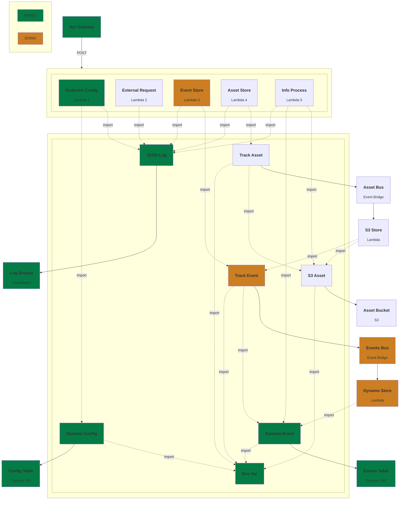

# go-lambda-api

```sh
# AWS DEPLOYMENT
task up
task down

# CURL LAMDA_CONFIG
curl --location 'http://localhost:4566/restapis/<uuid>/test-app/_user_request_/<step_function>' \
--header 'Content-Type: text/plain' \
--header 'origin: http://localhost:4566' \
--data '{}'

# LAMBDA LOGS
task apps:lambdas:endpoint_config:logs

# LAMBDA TEST
task apps:lambdas:endpoint_config:dev
task apps:lambdas:endpoint_config:start
task apps:lambdas:endpoint_config:invoke
```



